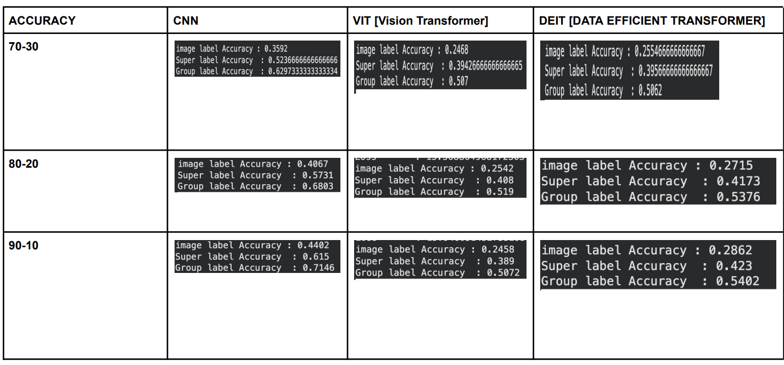
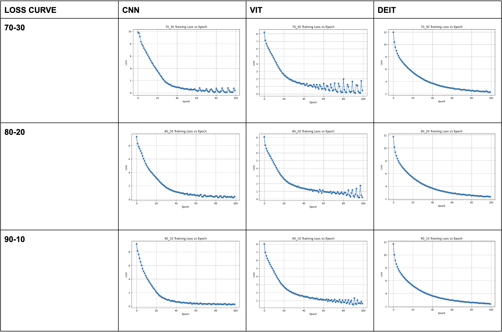
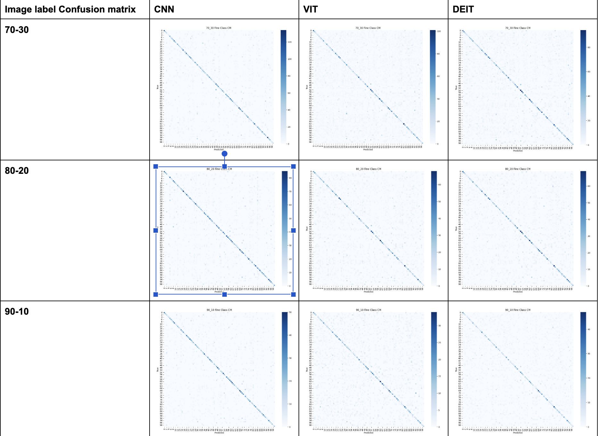
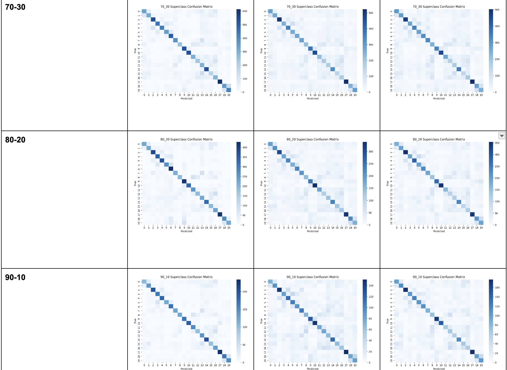
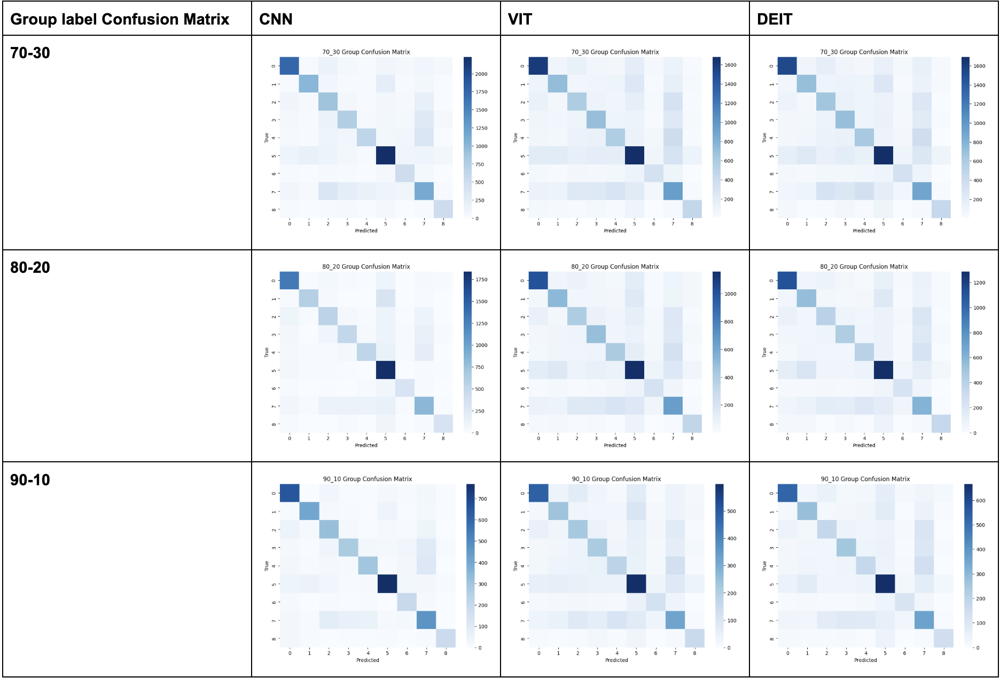

# Multi-Task Hierarchical Classification on CIFAR-100 using CNN, Vision Transformer and DeiT

# Google Colab

🔗 https://drive.google.com/file/d/1isjppOv8yctJEho_6VGM5EDzX52qlp4U/view?usp=drive_link

---

# Handwritten Report

📄 https://drive.google.com/file/d/1BFl81deQupWheamdOtoS-eGbYFAu3zgB/view?usp=drive_link

---

## Introduction

This project explores hierarchical image classification on the CIFAR-100 dataset using three different deep learning architectures:

* Convolutional Neural Network (CNN)
* Vision Transformer (ViT)
* Data-efficient Image Transformer (DeiT)

Unlike standard image classification, this project performs multi-task learning by simultaneously predicting:

1. Fine Class Label (100 Classes)
2. Superclass Label (20 Classes)
3. Group Label (9 Groups)

The objective is to compare CNNs and Transformer-based architectures under different train-test splits and evaluate their ability to learn hierarchical relationships within the CIFAR-100 dataset.

---

# Dataset

## CIFAR-100

* 100 Fine Classes
* 20 Super Classes
* 9 Groups
* Image Size: 32 × 32 × 3

---

# Train-Test Splits

Experiments were performed using:

* 70-30 Split
* 80-20 Split
* 90-10 Split

---

# Accuracy Comparison

  

# Loss vs Epoch Graph Table

  

# image label Confusion Matrix Table

  

# Super class label Confusion Matrix Table

  

# group class label Confusion Matrix Table

  

---

# Models

## DeiT (Teacher + Student)

📦 https://drive.google.com/file/d/1sguHFRYyizHJXPtYVS-CMOxTVHNlDHJc/view?usp=drive_link

📦 https://drive.google.com/file/d/1JV2Xbyvw3_zqO0CfDKVRZVJas6-tlpCa/view?usp=drive_link

---

# Theory

## CNN Architecture

A residual CNN architecture was designed with three prediction heads:

* Fine Class Head (100 Classes)
* Superclass Head (20 Classes)
* Group Head (9 Classes)

The model uses residual connections, adaptive average pooling, dropout, and fully connected layers for hierarchical prediction.

---

## Vision Transformer (ViT)

The Vision Transformer divides the image into patches and converts them into tokens.

Components:

* Patch Embedding
* Positional Embedding
* CLS Token
* Multi-Head Self Attention
* Feed Forward Network
* Layer Normalization

The CLS token is used to predict all three hierarchical labels.

---

## DeiT

DeiT extends Vision Transformer using knowledge distillation.

Components:

* Teacher Network (ResNet50)
* Student Transformer
* CLS Token
* Distillation Token
* KL Divergence Loss

The student learns from both the ground truth labels and teacher predictions, resulting in improved performance compared to standard ViT.

---

## Evaluation Metrics

Performance was evaluated using:

* Fine Class Accuracy
* Superclass Accuracy
* Group Accuracy
* Confusion Matrix Analysis
* Training Loss Curves

---

## Conclusion

This project compares CNN, Vision Transformer, and DeiT architectures for hierarchical multi-task classification on CIFAR-100.

Experiments were conducted using three train-test splits (70-30, 80-20, and 90-10), and performance was evaluated at class, superclass, and group levels. The study highlights the strengths and weaknesses of convolutional and transformer-based architectures for hierarchical image understanding.

---

## GPU
* A100 GPU rented from Jarvis Labs

--- 

## Author

**Pranav Deshpande**
  IIT Jodhpur
* Deep Learning
* Computer Vision
* Multi-Task Learning

